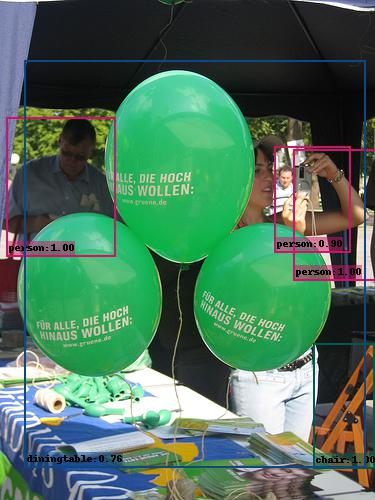

# SSD (Single Shot MultiBox Detector)


This repository implements [SSD (Single Shot MultiBox Detector)](https://arxiv.org/abs/1512.02325). 
The implementation is heavily influenced by the projects [lufficc/SSD](https://github.com/lufficc/SSD), 


## Environment

- **Docker image**: [pytorch:1.11.0-cuda11.3-cudnn8-devel](https://hub.docker.com/r/pytorch/pytorch/tags?page=1&name=1.11)
- **GPU** : RTX 3060

## Installation
### Requirements

1. Python3
1. PyTorch 1.0 or higher
1. yacs
1. [Vizer](https://github.com/lufficc/Vizer)
1. GCC >= 4.9
1. OpenCV


### Step-by-step installation

```bash
1. Download Docker Image
2. Run docker container 
3. Install above requirements
```

## DATASETS

### Pascal VOC

For Pascal VOC dataset, make the folder structure like this:
```
VOC_ROOT
|__ VOC2007
    |_ JPEGImages
    |_ Annotations
    |_ ImageSets
    |_ SegmentationClass
|__ VOC2012
    |_ JPEGImages
    |_ Annotations
    |_ ImageSets
    |_ SegmentationClass
|__ ...
```
Where `VOC_ROOT` default is `datasets` folder in current project, you can create symlinks to `datasets` or `export VOC_ROOT="/path/to/voc_root"`.


```bash
# for example, train SSD300:
python train.py --config-file configs/vgg_ssd300_voc0712.yaml
```

## Evaluate

### Single GPU evaluating

```bash
# for example, evaluate SSD300:
python test.py --config-file configs/vgg_ssd300_voc0712.yaml
```

```bash
# evaluate result
2022-06-20 03:56:42,199 SSD.inference INFO: mAP: 0.6097
aeroplane       : 0.6862
bicycle         : 0.6853
bird            : 0.5771
boat            : 0.4887
bottle          : 0.2699
bus             : 0.7256
car             : 0.7393
cat             : 0.7673
chair           : 0.3648
cow             : 0.6495
diningtable     : 0.5953
dog             : 0.7349
horse           : 0.7444
motorbike       : 0.7151
person          : 0.6292
pottedplant     : 0.2678
sheep           : 0.5988
sofa            : 0.6334
train           : 0.7357
tvmonitor       : 0.5852
```

## VISUALIZE

Predicting image in a folder is simple:
```bash
python demo.py --config-file configs/vgg_ssd300_voc0712.yaml --images_dir demo --ckpt https://github.com/lush-toner/SSD/releases/download/1.0/model_final.pth
```
Then it will download and cache `vgg_ssd300_voc0712.pth` automatically and predicted images with boxes, scores and label names will saved to `demo/result` folder by default.


<div align="center">
  
  
  <p>Example SSD output (vgg_ssd300_voc0712).</p>
</div>